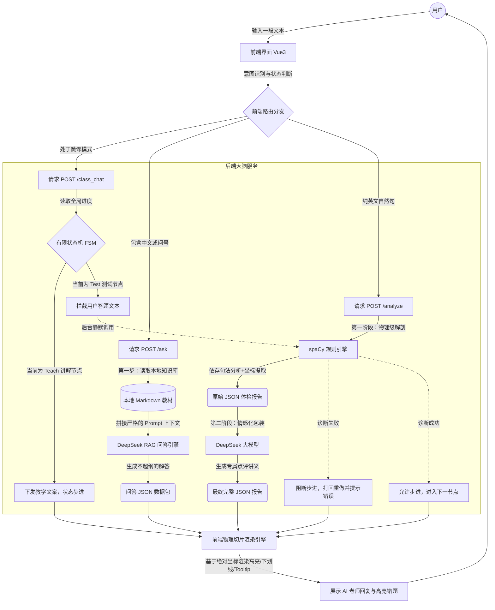

# AI English Grammar Teacher (AI 英语语法智能辅导系统)


## 🌟 项目简介 (Overview)
本项目是一个基于 Vue 3 与 FastAPI 构建的垂直领域 AI 教育 Agent 全栈应用。

在当前的 AI 教育赛道，纯 LLM 应用极易在严谨的语法规则上产生“幻觉”。本项目旨在破解这一核心痛点，通过**融合传统 NLP 规则引擎的确定性与 LLM 的生成能力**，打造了一款具备高容错率、高精确度可视化诊断，且能主动把控教学节奏的商业级 AI 私教产品。

**🚀 在线体验 Demo:** [点击这里访问 Vercel 公网环境](https://ai-english-teacher-77da.vercel.app/index.html)
*(注：后端部署于 Serverless 免费节点，首次对话可能需要约 30 秒的冷启动唤醒时间，请耐心等待。)*

---

## 🏗️ 系统架构与数据流 (System Architecture)

本项目彻底实现了前后端分离，核心业务逻辑包含三大链路：语法物理级诊断、RAG 教材问答、FSM 状态机课堂流转。



---

## 💡 核心技术亮点 (Technical Highlights)

### 1. 神经符号混合架构 (Neuro-Symbolic Hybrid Architecture)
摒弃了让 LLM 直接输出前端渲染坐标的不可靠方案。底层由 `spaCy` NLP 引擎进行物理级依存句法分析（Dependency Parsing），并由 Pydantic 严格校验后输出高精度的 JSON 绝对坐标；顶层 LLM（DeepSeek）仅基于该结构化数据进行上下文学习（In-context Learning），生成教学文案。实现了**“工程底线防守 + AI 体验跃升”**。

### 2. 复杂 DOM 多图层物理切片渲染 (Vue 3 Custom Rendering)
在 Web 端实现了堪比原生客户端的富文本语法高亮交互。基于 Vue 3 Composition API 手写文本分块算法，将后端返回的语法坐标映射为独立 HTML 节点，实现了底层背景色（基础成分）、虚线下划线（长难句/从句结构）及悬浮 Tooltip（错误纠正）的三重物理叠加视图。

### 3. 基于 RAG 架构的强管控知识库 (RAG-based Knowledge Retrieval)
为避免 AI 教师“超纲教学”或胡编乱造，系统接入了本地 Markdown 结构化教材库。触发提问时，系统将动态提取关联教材切片作为强上下文约束 LLM，确保教学严谨性。

### 4. 状态机驱动的主动式课堂 (FSM-driven Session Management)
突破传统 Chatbot 的被动问答模式，在后端构建基于有限状态机 (FSM) 的会话中枢。系统主动发起 Teach（讲解）与 Test（测试）节点循环；在测试环节接管用户输入，静默调用底层规则引擎进行校验，实现“不达标即拦截重做”的闭环教学体验。

---

## 🗂️ 项目结构 (Project Structure)
```text
.
├── main.py                # FastAPI 核心入口与 FSM 路由中枢
├── diagnostician.py       # spaCy 语法规则引擎与查错逻辑
├── llm_wrapper.py         # DeepSeek API 接入与 RAG 查询逻辑
├── schemas.py             # Pydantic 数据结构模型定义
├── index.html             # Vue 3 前端界面与多图层渲染引擎
├── textbooks/             # RAG 本地教材知识库
│   └── module2_sentence_structures.md
├── requirements.txt       # 云端部署核心依赖清单
├── .python-version        # 锁定 Vercel/Render 构建环境为 Python 3.12
└── .env.example           # 环境变量配置模板
```

---

## ⚙️ 本地运行与部署指南 (Local Setup)

1. **环境准备**: 建议使用 Conda 创建 Python 3.12 虚拟环境。
2. **安装依赖**:
   ```bash
   pip install -r requirements.txt
   python -m spacy download en_core_web_sm
   ```
3. **配置密钥**: 复制 `.env.example` 为 `.env`，填入你的 DeepSeek API Key。
4. **启动服务**:
   ```bash
   uvicorn main:app --reload
   ```
5. **访问页面**: 直接双击在浏览器中打开根目录下的 `index.html`，享受你的专属 AI 私教！