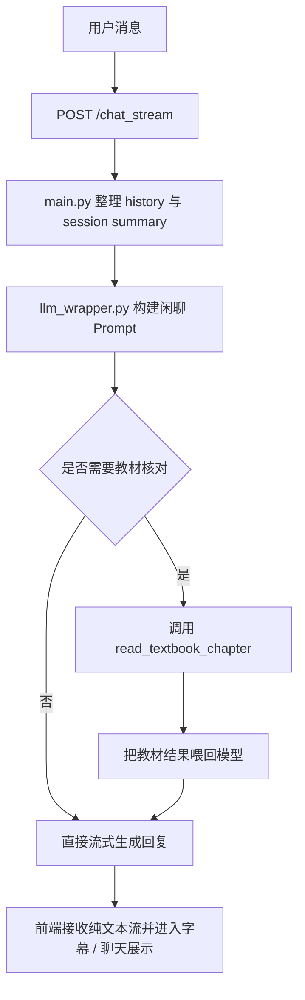
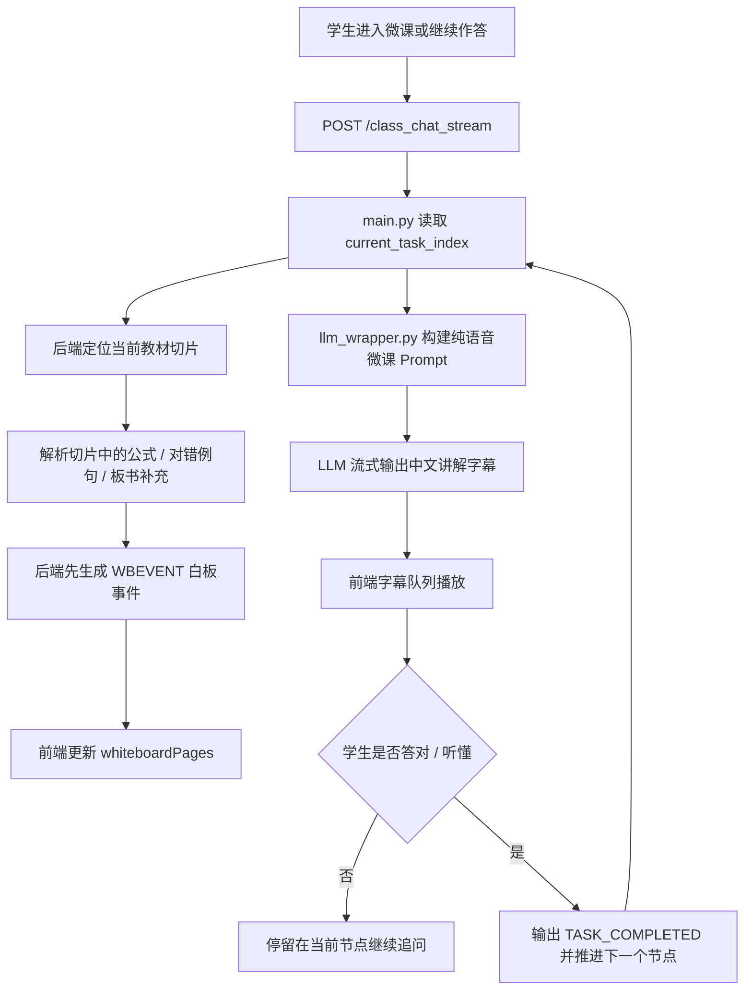
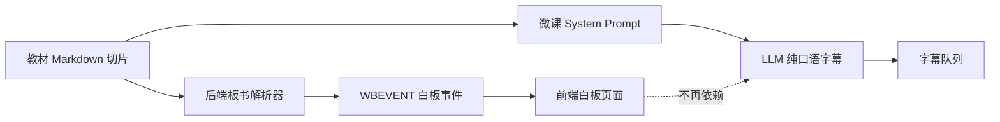

# AI English Teacher
## AI 虚拟英语老师


> 面向 B 站直播间场景的 AI 虚拟英语老师。  
> 当前项目已经从“传统语法分析器”重构为“沉浸式直播间 + 微课白板 + 流式字幕”的教学系统。

## 项目定位

当前系统有两条核心链路：

- `chat_stream`：直播间闲聊 / 英语答疑
- `class_chat_stream`：AI 微课讲授

现在的微课架构不再让大模型同时负责“写白板 + 讲字幕”。  
项目已经切到“双轨制并行架构”：

- 教研白板直达：后端根据当前教材切片，直接生成白板事件并推给前端
- LLM 纯语音讲解：大模型只负责口语化中文讲解和互动提问

这意味着：

- 白板内容由教材切片驱动，而不是由模型临场发挥
- 字幕内容由 LLM 流式输出驱动，但要求更短、更口语、更克制
- 前端不再从模型文本里猜白板协议，而是显式接收白板事件

## 当前架构重点

### 1. 闲聊 / 答疑模式

- 入口接口：`POST /chat_stream`
- 保留教材工具调用能力
- 只有在闲聊 / 答疑确实需要核对教材时，模型才会调用 `read_textbook_chapter`
- 适合开放式问答、闲聊、英语表达追问

### 2. 微课模式

- 入口接口：`POST /class_chat_stream`
- 微课链路已彻底移除白板 Tool Calling 和旧文本 DSL
- 后端会根据 `current_task_index` 精确读取当前教材切片
- 后端先把板书内容封装为 `<WBEVENT>...</WBEVENT>` 事件流给前端
- 之后才开始流式输出 LLM 的口语讲解字幕
- LLM 不再控制白板，只负责：
  - 用中文解释当前黑板重点
  - 结尾抛出一个问题
  - 等学生回答后再决定是否通关

### 3. 白板机制

- 白板数据来自 `data/textbooks/` 中当前节点的教材切片
- 后端会从切片中抽取三类信息：
  - `【白板核心公式】`
  - `【经典对错对比】`
  - 其他残留的板书补充内容
- 当前白板事件动作主要是：
  - `new_page`
  - `append`
- 前端收到事件后写入 `whiteboardPages`

### 4. 前端访问方式

- FastAPI 直接挂载 `frontend/`
- 推荐访问地址：`http://127.0.0.1:8000/frontend/index.html`
- 不再推荐 `file:///` 直接双击 HTML

## 流程图

### 闲聊 / 答疑链路



### 微课链路：双轨制并行架构



### 白板与字幕分离



## 目录结构

```text
AIEnglish_grammar_teacher/
|-- frontend/
|   `-- index.html             # 直播间 UI、白板舞台、字幕队列、Dashboard
|-- data/
|   |-- textbooks/             # AI-Native Markdown 教材库
|   `-- ai_teacher.db          # SQLite 数据库
|-- database/
|   |-- database.py            # SQLAlchemy engine / session
|   `-- models.py              # ErrorBook / StudentQuestion / KnowledgeMastery
|-- tools/
|   `-- textbook_tool.py       # 教材目录与章节读取工具（闲聊模式可调用）
|-- Open_AI_teacher.bat        # Windows 一键启动脚本
|-- llm_wrapper.py             # Prompt 构建、流式输出、闲聊 / 微课 LLM 封装
|-- main.py                    # FastAPI 路由、微课状态机、白板事件下发、静态托管
|-- config.py                  # 环境变量与共享配置
|-- requirements.txt
|-- .env.example
`-- README.md
```

## 快速开始

### 1. 克隆项目

```bash
git clone https://github.com/<your-account>/<your-repo>.git
cd AIEnglish_grammar_teacher
```

### 2. 配置环境变量

```bash
copy .env.example .env
```

示例：

```env
DEEPSEEK_API_KEY=your_api_key_here
DATABASE_URL=sqlite:///data/ai_teacher.db
DEFAULT_STUDENT_ID=TestUser
```

### 3. 安装依赖

```bash
pip install -r requirements.txt
```

### 4. 启动服务

```bash
uvicorn main:app --reload
```

或者使用项目自带脚本：

```bat
Open_AI_teacher.bat
```

### 5. 打开前端

推荐地址：

```text
http://127.0.0.1:8000/frontend/index.html
```

如果只想确认后端在线，也可以访问：

```text
http://127.0.0.1:8000/docs
```

## 主要接口

- `POST /chat_stream`：直播间闲聊 / 英语答疑
- `POST /class_chat_stream`：微课讲授
- `POST /course/exit`：退出微课并重置进度
- `GET /api/dashboard/data`：Dashboard 数据
- `GET /frontend/index.html`：前端入口

## 数据层说明

- `ErrorBook`：记录微课中暴露出的语法错误
- `StudentQuestion`：记录学生在闲聊和微课中的主动提问
- `KnowledgeMastery`：按知识点维护掌握度与状态

## 教材体系

教材位于 `data/textbooks/`，目前以 AI-Native 结构组织，重点服务直播式教学：

- `00_Grammar_Overview.md`
- `01_Verb.md`
- `02_Subordinate_Clause.md`
- `03_Parts_of_Speech.md`

当前教材中的知识点统一按以下结构整理：

- `【白板核心公式】`
- `【经典对错对比】`
- `【AI 主播话术与人设 Trigger】`

## 近期关键更新

- 微课链路切到“双轨制并行架构”
- 废弃旧的白板 Tool Calling / 文本 DSL
- 后端新增 `WBEVENT` 白板事件流
- 前端改为显式接收白板事件，不再从模型文本中猜白板指令
- LLM 微课 Prompt 改为“纯口语字幕 + 强制提问 + 句数限制”
- 白板 UI 升级为多页直播间式演示板，支持翻页、红点提示和追加动画
- 字幕队列升级为双行滚动保留策略，并过滤 Markdown 噪音

## 后续可扩展方向

- 为白板补上真正的 `question` 事件，让互动问题也上板
- 把当前白板块升级成更强的 DSL / SVG 板书效果
- 为字幕增加运行时守门器，拦截异常协议碎片或长英文例句污染
- 接入更完整的课堂编排层，让“节点推进”和“提问上板”分离控制
