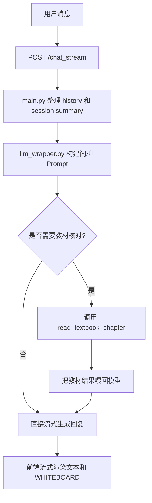
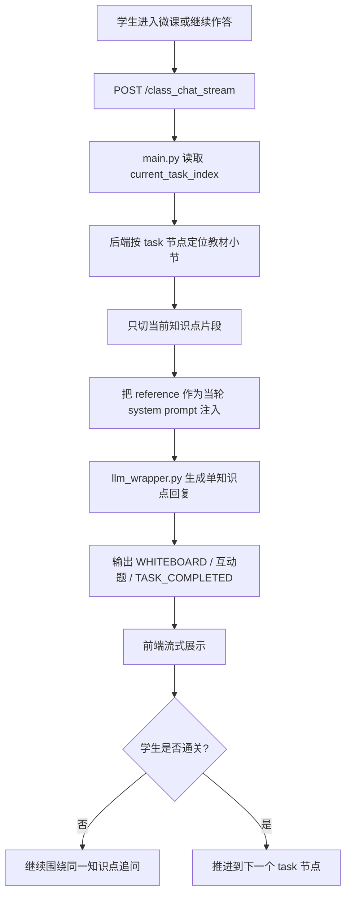
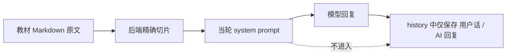

# AI English Teacher
## AI 虚拟英语老师


> 面向 B 站直播间场景的 AI 虚拟英语老师。  
> 现在的核心定位是：闲聊像主播，讲课像毒舌名师，微课链路走“后端精确滴灌”，不再让模型自己抱着教材满地乱翻。

## 项目概览

这个项目当前提供两条核心链路：

- `chat_stream`：直播间闲聊 / 英语答疑
- `class_chat_stream`：AI 微课讲授

它的几个关键特性已经和传统“AI 语法批改器”完全不是一个物种了：

- 固定人设：傲娇、毒舌、冷幽默、直播间 VTuber 英语老师
- 流式回复：前端实时接收文本与白板指令
- 白板协议：通过 `[WHITEBOARD: ...]` 输出核心板书
- 微课状态机：支持通关、追问、推进下一节点
- 学习记录：错题本、学生提问、掌握度快照、Dashboard
- 静态托管：FastAPI 直接挂载 `frontend/`，前后端同端口访问

## 当前架构重点

### 1. 闲聊 / 答疑模式

- 入口接口：`POST /chat_stream`
- 保留教材工具调用能力
- 只有在答疑确实需要核对教材时，模型才会触发 `read_textbook_chapter`
- 适合开放式问答、接梗、语法临时追问

### 2. 微课模式

- 入口接口：`POST /class_chat_stream`
- 已彻底移除微课链路中的教材工具调用
- 改为后端依据当前教学节点，直接从 `data/textbooks/` 精确切出一个很小的知识点片段
- 该片段只注入到当轮 system prompt，阅后即焚，不进入多轮 history
- 配合“每次只讲一个知识点”的提示词刹车机制，避免一轮讲爆多个点

### 3. 前端访问方式

- FastAPI 直接挂载 `frontend/`
- 推荐访问地址：`http://127.0.0.1:8000/frontend/index.html`
- 不再推荐 `file:///` 直接双击 HTML

## 流程图

### 闲聊 / 答疑链路



### 微课链路：后端精确滴灌



### 微课与历史隔离



## 目录结构

```text
AIEnglish_grammar_teacher/
|-- frontend/
|   `-- index.html             # 聊天 UI、微课 UI、Dashboard、白板协议处理
|-- data/
|   |-- textbooks/             # AI-Native Markdown 教材库
|   `-- ai_teacher.db          # SQLite 数据库
|-- database/
|   |-- database.py            # SQLAlchemy engine / session
|   `-- models.py              # ErrorBook / StudentQuestion / KnowledgeMastery
|-- tools/
|   `-- textbook_tool.py       # 教材目录与章节读取工具（闲聊模式仍可调用）
|-- Open_AI_teacher.bat        # Windows 一键启动脚本
|-- llm_wrapper.py             # Prompt 构建、流式输出、闲聊 / 微课 LLM 封装
|-- main.py                    # FastAPI 路由、微课状态机、静态托管、Dashboard API
|-- config.py                  # 环境变量与共享配置
|-- requirements.txt
|-- .env.example
`-- README.md
```

## 快速开始

### 1. 克隆项目

```bash
git clone https://github.com/<your-account>/<your-repo>.git
cd AIEnglish_grammar_teacher
```

### 2. 配置环境变量

```bash
copy .env.example .env
```

示例：

```env
DEEPSEEK_API_KEY=your_api_key_here
DATABASE_URL=sqlite:///data/ai_teacher.db
DEFAULT_STUDENT_ID=TestUser
```

### 3. 安装依赖

```bash
pip install -r requirements.txt
```

### 4. 启动服务

你可以直接运行：

```bash
uvicorn main:app --reload
```

也可以用项目自带的一键启动脚本：

```bat
Open_AI_teacher.bat
```

### 5. 打开前端

推荐地址：

```text
http://127.0.0.1:8000/frontend/index.html
```

如果你只想确认后端活着没死，也可以访问：

```text
http://127.0.0.1:8000/docs
```

## 主要接口

- `POST /chat_stream`：直播间闲聊 / 英语答疑
- `POST /class_chat_stream`：微课讲授
- `POST /course/exit`：退出微课并重置进度
- `GET /api/dashboard/data`：Dashboard 数据
- `GET /frontend/index.html`：前端入口

## 数据层说明

- `ErrorBook`：记录微课中暴露出的语法错误
- `StudentQuestion`：记录学生在闲聊和微课中的主动提问
- `KnowledgeMastery`：按知识点维护掌握度与状态

当前前端已经移除了“AI 潜意识记忆”调试面板，不再对终端用户暴露内部 Debug 视图。

## 教材体系

教材位于 `data/textbooks/`，目前以 AI-Native 结构组织，重点面向直播讲课而不是人类慢读：

- `00_Grammar_Overview.md`
- `01_Verb.md`
- `02_Subordinate_Clause.md`
- `03_Parts_of_Speech.md`

这些教材中的知识点统一按以下结构整理：

- `【白板核心公式】`
- `【经典对错对比】`
- `【AI 主播话术与人设 Trigger】`

## 近期关键更新

- 微课 Prompt 强制执行“每次只讲一个知识点”
- 微课模式从“模型主动调教材工具”重构为“后端精确切片 + 单次注入”
- 修复流式输出中误删英文空格的问题
- FastAPI 直接托管 `frontend/`，解决 `file:///` 样式丢失问题
- 前端移除了“AI 潜意识记忆”悬浮 Debug 面板

## 后续可扩展方向

- 接入弹幕平台或直播推流控制层
- 把白板协议升级为独立可视化组件
- 把掌握度和错题系统接到更完整的学情档案
- 拆分更多微课节点，进一步压低单轮 Prefill 成本
