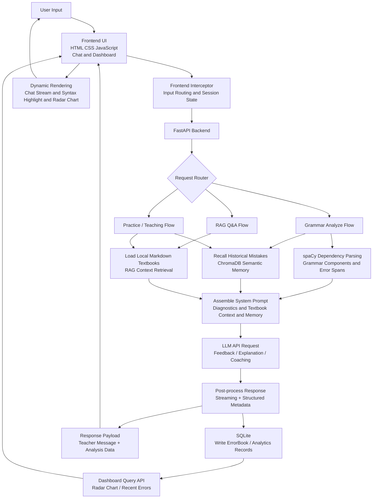

# AI English Grammar Teacher
## AI 英语语法老师


> A full-stack AI tutoring system that does more than answer grammar questions.  
> It diagnoses sentence structure with deterministic NLP, retrieves textbook-grounded knowledge with RAG, tracks recurring weaknesses, and turns every interaction into a personalized coaching loop.
>
> 这不是一个“只会聊天”的英语助手，而是一个具备教学策略的 AI 语法导师：它会分析句法、引用教材、记住错误、追踪弱点，并以强风格化但专业克制的方式给出反馈。

## Project Highlights | 项目亮点

- **Neuro-symbolic tutoring pipeline**: combines `spaCy` dependency parsing with LLM generation, reducing pure-LLM hallucination in grammar explanation.
- **Adaptive Prompting**: dynamically assembles system prompts from sentence diagnostics, textbook context, and historical mistake memory.
- **RAG over local curriculum**: reads local Markdown textbooks and constrains answers to project-defined teaching scope.
- **Weakness tracking & learning memory**: persists error traces into SQLite and recalls similar mistakes via ChromaDB-based semantic memory.
- **Portfolio-grade product surface**: includes a front-end chat experience, syntax visualization, streaming responses, and an ECharts radar dashboard.
- **Deployment-ready hygiene**: `.env` secret isolation, CORS handling, configurable local/public API endpoint switching, and Git-safe repository layout.

---

## Architecture Diagram | 系统架构图



---

## Core Capabilities | 核心功能能力

### 1. Deterministic Grammar Diagnosis
The backend uses `spaCy` to perform dependency parsing and component extraction before any LLM call is made. This makes the system capable of locating subject, predicate, object, structural clauses, and error spans with deterministic coordinates rather than relying on model guesses alone.

后端先进行 `spaCy` 句法分析，再把结构化结果交给 LLM。这种“先诊断、后生成”的路径，让系统能够更稳定地给出语法成分标注、高亮范围和错误定位。

### 2. Adaptive Prompting
Prompt construction is dynamic rather than static. The final system prompt can include:

- sentence-level diagnostic evidence
- retrieved textbook excerpts
- recalled historical mistakes for the same learner
- task-mode specific teaching instructions

这意味着 AI 输出并非固定模板，而是根据输入句子、历史错误和教材上下文实时调整。

### 3. RAG with Local Markdown Knowledge Base
The project reads local Markdown textbooks under `data/textbooks/` and injects relevant instructional context into the LLM request. This keeps responses aligned with the project’s curriculum boundary and makes the behavior easier to audit than open-ended chat.

### 4. Weakness Tracking and Memory Loop
When a learner repeatedly makes similar mistakes, the system can recall those patterns and reflect them in the next round of feedback. In practice, this creates a lightweight personalized tutoring loop instead of isolated single-turn corrections.

项目中同时存在两类“记忆”：

- **SQLite persistence**: stores structured error records in the `error_book` table for dashboards and historical review
- **ChromaDB semantic memory**: recalls similar mistakes to enrich future prompts

### 5. Frontend Visualization and Progressive Disclosure Potential
The frontend is implemented as a lightweight single-page interface using HTML/CSS/JavaScript, with runtime libraries loaded via CDN. It supports:

- streaming chat interaction
- syntax-highlighted sentence rendering
- Markdown response display
- radar-chart based weakness distribution with `ECharts`

这种界面结构天然适合做 progressive disclosure：先展示结论，再逐步展开句法证据、历史错题和统计视图。

### 6. Engineering Readiness
The repository has been cleaned for public sharing and engineering demonstration:

- `.env`-based secret management
- `.env.example` for onboarding
- configurable `DATABASE_URL`, `DEFAULT_STUDENT_ID`, `CHROMA_DB_PATH`
- CORS middleware for local/static frontend integration
- local/public backend switching in the frontend entry file

---

## Getting Started | 快速开始

### 1. Clone Repository

```bash
git clone https://github.com/<your-account>/<your-repo>.git
cd AIEnglish_grammar_teacher
```

### 2. Create Virtual Environment

```bash
python -m venv .venv
```

Windows:

```bash
.venv\Scripts\activate
```

macOS / Linux:

```bash
source .venv/bin/activate
```

### 3. Configure Environment Variables

Copy `.env.example` to `.env`, then fill in your real values:

```bash
copy .env.example .env
```

or:

```bash
cp .env.example .env
```

Example:

```env
DEEPSEEK_API_KEY=your_api_key_here
DATABASE_URL=sqlite:///data/ai_teacher.db
DEFAULT_STUDENT_ID=TestUser
CHROMA_DB_PATH=./data/chroma_db
```

说明：

- `DEEPSEEK_API_KEY`: LLM API key
- `DATABASE_URL`: SQLite or other SQLAlchemy-compatible database URL
- `DEFAULT_STUDENT_ID`: default learner identity used in local testing
- `CHROMA_DB_PATH`: local semantic memory storage path

### 4. Install Dependencies

```bash
pip install -r requirements.txt
python -m spacy download en_core_web_sm
```

### 5. Start Backend

```bash
uvicorn main:app --reload
```

Default backend address:

```text
http://127.0.0.1:8000
```

### 6. Start Frontend

This project does not require a front-end build step.

Option A: open the static entry directly

```bash
frontend/index.html
```

Option B: serve the directory with a simple static server

```bash
python -m http.server 5500
```

Then open:

```text
http://127.0.0.1:5500/frontend/index.html
```

### 7. Switch Local / Public API Endpoint

In `frontend/index.html`, update the `BASE_URL` constant to target your local or deployed FastAPI service.

```javascript
const BASE_URL = "http://127.0.0.1:8000";
// const BASE_URL = "https://your-public-api.example.com";
```

---

## Directory Structure | 目录结构

```text
AIEnglish_grammar_teacher/
|-- frontend/
|   `-- index.html             # Frontend UI, streaming chat, dashboard, ECharts rendering
|-- data/
|   |-- textbooks/             # Local Markdown knowledge base for RAG
|   |   |-- 00_Grammar_Overview.md
|   |   |-- 01_Verb.md
|   |   `-- 02_Subordinate_Clause.md
|   |-- ai_teacher.db          # Local SQLite database (configurable via DATABASE_URL)
|   `-- chroma_db/             # ChromaDB semantic memory store
|-- database/
|   |-- database.py            # SQLAlchemy engine/session setup
|   `-- models.py              # ErrorBook and related persistence models
|-- config.py                  # Environment loading and shared runtime configuration
|-- diagnostician.py           # spaCy-based syntax diagnosis and grammar checks
|-- llm_wrapper.py             # LLM API orchestration and prompt assembly
|-- main.py                    # FastAPI entry, routing, streaming, dashboard APIs
|-- memory_manager.py          # Historical mistake memory read/write
|-- schemas.py                 # Pydantic schemas for analysis payloads
|-- .env.example               # Public-safe environment template
`-- README.md
```

---

## Why This Project Matters | 为什么这个项目适合作为作品集展示

This project demonstrates more than API wiring. It shows the ability to design and integrate:

- full-stack product flow
- AI application architecture
- deterministic NLP + generative AI orchestration
- prompt engineering with retrieval and memory
- analytics-oriented persistence
- local-first developer experience and deployment hygiene

如果你在寻找一类能体现“工程能力 + AI 应用设计能力 + 产品感知”的项目，这个仓库更接近一个可演示、可扩展、可讲故事的完整作品，而不只是一个简单的聊天页面。

---

## Tech Stack | 技术栈

- **Frontend**: HTML, CSS, JavaScript, Vue runtime via CDN, Axios, ECharts, Marked
- **Backend**: Python, FastAPI
- **NLP**: spaCy
- **LLM Integration**: OpenAI-compatible API client, RAG-style prompt augmentation
- **Persistence**: SQLite, SQLAlchemy
- **Memory Layer**: ChromaDB
- **Configuration**: `.env`, `python-dotenv`

---

## License

For portfolio and demonstration use. Add your preferred open-source license before public release if needed.
