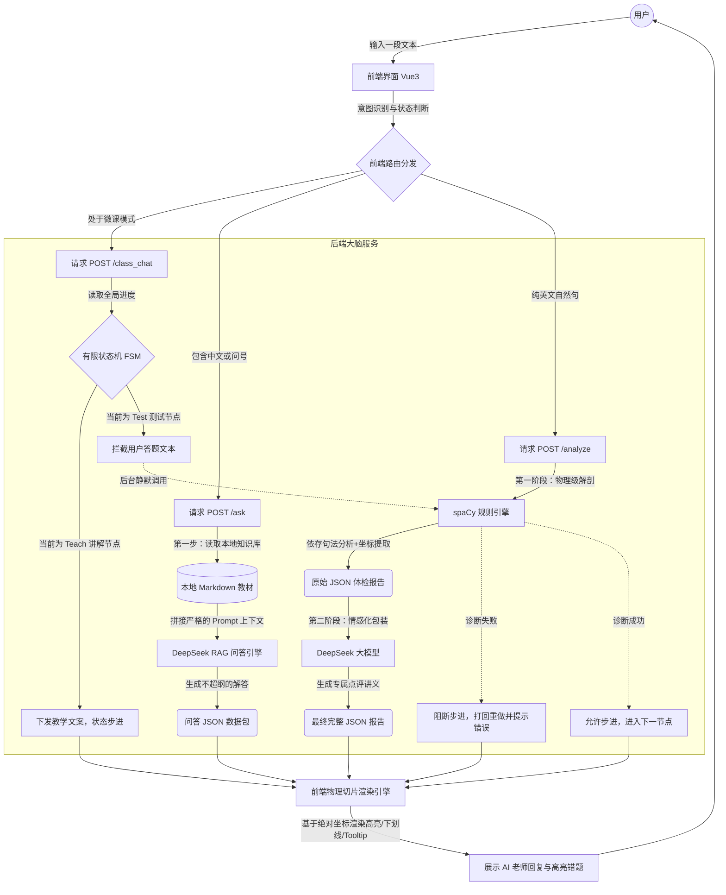

# AI English Grammar Teacher (AI 英语语法智能辅导系统)


## 🌟 项目简介 (Overview)
本项目是一个基于 Vue 3 与 FastAPI 构建的全栈 AI 教育交互应用。项目深度实践了 AI 驱动的现代开发工作流，实现了从底层 NLP 算法解析、大语言模型工程化接入，到跨端复杂前端 DOM 渲染的完整闭环。该系统旨在破解教育类 AI 频发“幻觉”的行业痛点，通过融合传统 NLP 规则引擎与 LLM 生成能力，提供具备高度可控性与专业教学逻辑的英语语法辅导体验。

**🚀 在线体验 Demo:** [点击这里访问你的 Vercel 链接](将这里替换为你的真实Vercel链接)
*(注：后端采用 Serverless 免费节点，首次对话可能需要 30 秒左右的冷启动唤醒时间，请耐心等待~)*

---

## 🏗️ 核心架构与技术亮点 (Architecture & Features)

### 1. NLP 与 LLM 混合语法诊断引擎 (Hybrid Diagnostic Engine)
- **工程挑战**：纯 LLM 在输出精细化坐标以控制前端 DOM 渲染时极易出现幻觉，且结构化数据输出极不稳定。
- **解决方案**：采用双层架构。底层接入 `spaCy` NLP 引擎进行物理级的依存句法分析（SVO 骨架提取与从句拆解），通过 `Pydantic` 严格校验并输出高精度的 JSON 坐标数据；顶层接入 DeepSeek 大模型，基于底层结构化数据进行上下文学习 (In-context Learning)，生成平易近人的拟人化纠错解析。

### 2. 基于 RAG 架构的动态知识库管控 (RAG-based Knowledge Retrieval)
- **工程挑战**：需严格限制教学 AI 的发散边界，避免超纲解答或编造教学内容。
- **解决方案**：设计并接入本地 Markdown 结构化教材库（如涵盖基本句型与 There be 句型等规则的教案）。后端通过智能路由拦截用户意图，命中提问逻辑后，启动 RAG 机制，将特定教材切片作为 Prompt 上下文强制约束 LLM 的推理边界，确保输出严格贴合官方课程大纲。

### 3. 基于有限状态机的主动式课堂中枢 (FSM-driven Session Management)
- **工程挑战**：传统问答型 Chatbot 无法主导多轮对话节奏，难以实现具有闭环属性的教学体验。
- **解决方案**：在后端构建基于有限状态机 (FSM) 的会话控制中枢。将教学过程抽象为 `Teach` (知识讲解) 与 `Test` (随堂测试) 节点。系统在 Test 状态下接管用户输入，内部静默调用语法诊断流进行逻辑评估，实现“不达标即拦截重试”的控制权反转。

### 4. 复杂 DOM 多图层物理切片渲染 (Vue 3 Custom Rendering)
- **工程挑战**：需在 Web 端实现堪比原生客户端的富文本语法高亮与层级反馈。
- **解决方案**：脱离常规富文本框渲染模式，基于 Vue 3 Composition API 手写文本分块与坐标映射算法。将后端返回的绝对语法坐标映射为独立 HTML 节点，实现底层背景色（基础成分）、虚线下划线（复杂结构）及悬浮 Tooltip（错误解析）的三重物理叠加视图。

---

## 🛠️ 技术栈选型 (Technology Stack)

- **前端架构**：Vue 3 (Composition API), HTML5, TailwindCSS, Axios
- **后端服务**：Python 3.12, FastAPI, Uvicorn, Pydantic
- **核心算法**：OpenAI SDK, spaCy (en_core_web_sm), DeepSeek Chat API
- **部署环境**：Vercel (Frontend), Render (Backend)

---

## ⚙️ 本地运行与部署指南 (Quick Start)

### 1. 克隆代码仓库
```bash
git clone [https://github.com/jacobsisir-glitch/AI-English-Teacher.git](https://github.com/jacobsisir-glitch/AI-English-Teacher.git)
cd AI-English-Teacher
